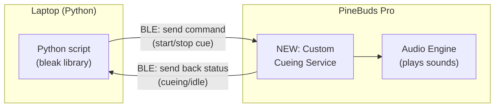
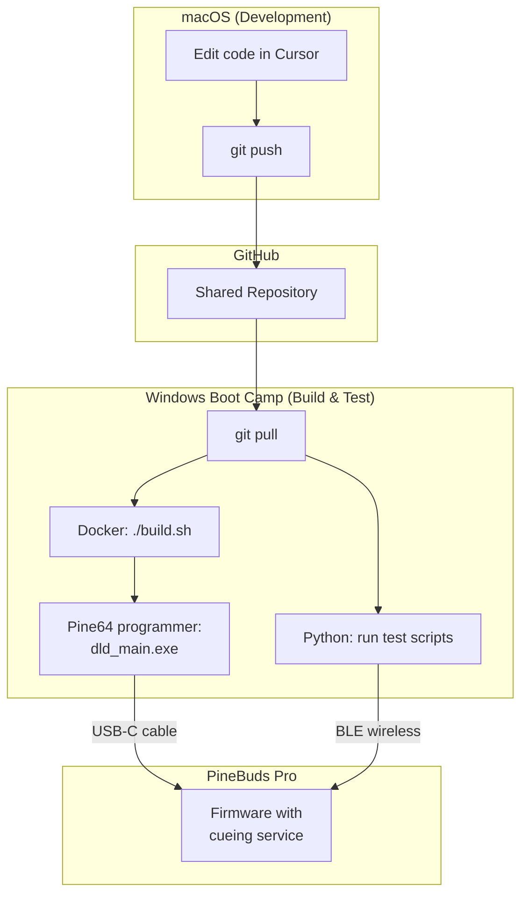

# What Was Changed and Why — A Plain-English Guide

This document walks through every change made to the OpenPineBuds firmware and every new Python script added on the host side. It is written for someone who does not have deep knowledge of Bluetooth, embedded systems, or the BES2300 chip that powers the PineBuds Pro.

---

## 1. The Big Picture

The PineBuds Pro are open-source wireless earbuds. Out of the box, their firmware supports normal audio features — playing music, taking calls, pairing with a phone — all over "classic" Bluetooth.

The goal of this project is to make the earbuds do something new: **respond to wireless commands from a computer and play specific audio cues on demand**. This is for a system that helps people with Parkinson's disease by playing rhythmic sounds (like a metronome click) when a "freezing of gait" episode is detected by sensors.

The problem is that the stock firmware does not expose any way for a computer program to send it custom commands. The earbuds only understand standard audio protocols. We need to add a new "interface" — a custom Bluetooth Low Energy (BLE) service — that a Python script on a laptop can talk to.

---

## 2. How Bluetooth Low Energy Works (Simplified)

Think of a BLE device like a **restaurant with a menu**.

- The **restaurant** is the earbud. It advertises its name ("D&D TECH" over BLE) so nearby devices can find it.
- A **menu** is called a **GATT Service**. It is a group of related things the earbud can do. Each service has a unique ID (called a UUID) so it can be told apart from other services.
- Each **dish on the menu** is called a **Characteristic**. A characteristic is a single piece of data you can interact with. Some characteristics you can read (like checking the price), some you can write to (like placing an order), and some can send you updates automatically (called "notifications" — like the waiter telling you your food is ready).

In our case, we added a new menu (service) to the earbud with three dishes (characteristics):

| Characteristic | What it does | How you interact |
|---|---|---|
| **Cue Command** | You send commands here: "start playing a sound" or "stop" | Write |
| **Cue Status** | The earbud tells you what it is doing: idle, cueing, or error | Read and Notify |
| **Cue Config** | You set parameters here: which tone, how loud, how long | Read and Write |

Each of these has its own UUID — a long unique string like `ac000002-cafe-b0ba-f001-deadbeef0000` — that the Python script uses to find and talk to the right characteristic.

---

## 3. What We Added to the Earbud Firmware

The firmware is written in C and uses a layered architecture. Adding a new BLE service requires changes at three levels: the **profile layer**, the **app layer**, and small pieces of **registration glue** in existing files.

We followed the exact same pattern used by an existing service in the firmware called `DATAPATHPS` (a data path server). Every structural decision mirrors that existing code, adapted for our cueing use case.

### 3a. The Profile Layer — "Telling Bluetooth what exists"

These files define the GATT service at the Bluetooth protocol level. They describe what characteristics exist, what their UUIDs are, and what permissions they have (read, write, notify). They also handle the low-level Bluetooth messages when a remote device reads or writes a characteristic.

**New files:**

- `services/ble_profiles/cueing/cueingps/api/cueingps_task.h`
  Defines the message IDs and data structures used to pass information between the Bluetooth stack and our application code. For example, it defines a "command received" message and a "send status notification" message.

- `services/ble_profiles/cueing/cueingps/src/cueingps.h`
  Defines the attribute state machine — an enum listing every entry in our GATT table (service declaration, each characteristic declaration, each value, each descriptor). Also defines the environment struct that holds per-connection state like "are notifications enabled for this connection?"

- `services/ble_profiles/cueing/cueingps/src/cueingps.c`
  Contains the actual **GATT attribute database** — a table that maps each attribute index to its UUID, permissions, and maximum data length. This is the "menu" that Bluetooth reads to know what the service offers. Also contains lifecycle functions (init, destroy, create, cleanup) that allocate and free memory for the service.

- `services/ble_profiles/cueing/cueingps/src/cueingps_task.c`
  Handles the raw Bluetooth events: when a remote device writes to a characteristic, this code figures out *which* characteristic was written to and forwards the data up to the application layer as a kernel message. It also handles read requests and sends back the appropriate data.

### 3b. The App Layer — "Deciding what to do"

These files contain the actual application logic. When the profile layer says "someone wrote bytes to the Cue Command characteristic," the app layer decides what those bytes mean and takes action.

**New files:**

- `services/ble_app/app_cueing/app_cueing_server.h`
  Public header file. Defines the command bytes (`0x01` = start, `0x02` = stop, `0x03` = configure), the status bytes (`0x00` = idle, `0x01` = cueing), and the configuration structure (tone ID, volume, duration, burst count, burst gap). Also tracks burst playback state.

- `services/ble_app/app_cueing/app_cueing_server.c`
  The heart of the feature. Implements:
  - **Volume control**: Maps the 0-100 percentage from the host to the hardware's 16 volume levels via `app_bt_stream_volumeset()`.
  - **Duration-based auto-stop**: Uses BLE kernel timers (`ke_timer_set`) to automatically stop the cue after the configured `duration_ms`.
  - **Burst patterns**: Chains kernel timers to play N tone bursts separated by configurable gaps. Each burst plays a tone for `duration_ms`, waits `burst_gap_ms`, then repeats.
  - **Low-latency connection params**: When the client enables notifications, the firmware requests a 7.5-10ms connection interval update for minimal BLE round-trip latency.
  - **Audio stop**: Uses `app_audio_manager_sendrequest(APP_BT_STREAM_MANAGER_STOP, ...)` to properly stop media playback (the original `trigger_media_stop()` only handled one specific audio ID).

### 3c. Registration Glue — "Telling the existing firmware about the new service"

The firmware does not automatically discover new code. Several existing files had small additions to make them aware of the new cueing service. Every change follows the exact pattern already used for `DATAPATHPS`.

**Modified files:**

- `services/ble_stack/ble_ip/rwip_task.h`
  Added `TASK_ID_CUEINGPS = 78` to the task ID enum. Every BLE service needs a unique numeric ID in the system. The existing data path server is 74; ours is 78.

- `services/ble_stack/ble_ip/rwapp_config.h`
  Added `CFG_APP_CUEING_SERVER` (a build flag) and the corresponding `BLE_APP_CUEING_SERVER` macro. These act as on/off switches — if you remove the `#define`, the entire cueing service is excluded from the build.

- `services/ble_stack/ble_ip/rwprf_config.h`
  Added `BLE_CUEING_SERVER` at the profile level, and included it in the list of known profiles. This tells the BLE stack "there is one more profile that might need resources."

- `services/ble_profiles/prf/prf.c`
  This file is the **profile registry**. It has a big `switch` statement that maps task IDs to profile interface functions. We added a case for `TASK_ID_CUEINGPS` that returns `cueingps_prf_itf_get()` — the function pointer table from our profile layer.

- `services/ble_app/app_main/app_task.c`
  This file is the **message router**. When a BLE message arrives from the cueing profile, the router needs to know where to send it. We added a case that forwards messages from `TASK_ID_CUEINGPS` to `app_cueing_server_table_handler`. We also added disconnect and MTU-change handlers so the cueing service is properly notified of connection events.

- `services/ble_app/app_main/app.c`
  This file manages the list of services to register at boot. We added the cueing service to the enum of services (`APPM_SVC_CUEING_SERVER`), added its registration function (`app_cueing_add_cueingps`) to the function pointer array, and added its init function to the boot sequence.

- `services/ble_app/Makefile`
  Added `app_cueing/*.c` to the list of source files to compile, and added the include paths so the compiler can find the cueing headers.

- `services/ble_profiles/Makefile`
  Added `cueing/cueingps/src/*.c` to the list of source files, and added the include paths for the cueing profile headers.

---

## 4. Memory Optimizations

The BES2300YP chip inside the PineBuds Pro has only 992 KB of SRAM, shared between the operating system, audio codecs, Bluetooth Classic, the BLE host stack, and application code. Enabling the full BLE stack required disabling non-essential features to free enough RAM:

| What was disabled | Config flag | Why it's OK |
|---|---|---|
| Active Noise Cancellation (ANC) | `ANC_APP=0` and related flags | Not needed for cueing |
| LDAC audio codec | `A2DP_LDAC_ON=0` | High-quality codec not needed for alert tones |
| Dual BLE connections | `IS_USE_BLE_DUAL_CONNECTION=0` | Only one laptop connects at a time |
| Large trace buffer | `TRACE_BUF_SIZE := 4*1024` (was 16 KB) | Debugging still works, just smaller buffer |
| Core dump | `CORE_DUMP=0` | Saves RAM; not needed in production |

All of these are **build flags** in `config/open_source/target.mk`. Nothing was deleted from the codebase -- any feature can be re-enabled by changing the flag back, as long as the total RAM fits.

---

## 5. Bug Fixes Required to Make BLE Work

Three critical bugs had to be fixed after enabling BLE. Without these fixes, the earbuds either crashed on boot or were invisible to BLE scanners.

### 5a. Boot Crash Fix

**Problem:** When the earbud boots inside the charging case, the firmware detects "charging mode" and takes a shutdown path. This path eventually called a BLE function (`app_ble_is_any_connection_exist()`) -- but the BLE data structures had not been initialized yet, because the initialization call happened *after* the charging check. This caused a hard crash (the earbud got stuck with a constant red LED).

**Fix:** Moved `app_ble_mode_init()` earlier in the startup sequence (`apps/main/apps.cpp`), before the battery/charging check. Now BLE data structures are always initialized, regardless of whether the earbud is charging or not.

### 5b. BLE Advertising Fix (3 gates)

**Problem:** Even after booting successfully, the earbuds were invisible to BLE scanners. Three separate "gates" in the firmware's IBRT (True Wireless Stereo) layer were blocking advertising:

**Gate 1 -- IBRT Master role** (`services/ble_app/app_main/app_ble_core.c`):
The firmware only enabled BLE advertising when the earbud had the role `IBRT_MASTER` (meaning it had completed TWS pairing with the other earbud and was designated as the master). After a fresh flash, both earbuds have role `IBRT_UNKNOW`, so neither would ever advertise.
*Fix:* Changed to always enable advertising regardless of role.

**Gate 2 -- Box event deadlock** (`services/app_ibrt/src/app_ibrt_search_pair_ui.cpp`):
When the earbud boots in the case, an advertising "switch" is set to block advertising (because the earbud is in the box). When you take the earbud out, a "plug out" event should clear this switch. But the plug-out handler returned early when the role was `IBRT_UNKNOW`, so the switch was never cleared.
*Fix:* Removed the early returns so box events propagate regardless of TWS pairing state.

**Gate 3 -- advSwitch blocking** (`services/ble_app/app_main/app_ble_mode_switch.c`):
The `ble_adv_is_allowed()` function checked `bleModeEnv.advSwitch` and blocked advertising if any bit was set. Combined with Gate 2, this created a permanent block.
*Fix:* Changed to log the switch value but not use it as a blocking condition.

### 5c. ANC Compile Fix

**Problem:** Disabling ANC (`ANC_APP=0`) caused a build error because `app_anc_key()` was called unconditionally in `app_ibrt_keyboard.cpp`.

**Fix:** Wrapped the call with `#ifdef ANC_APP`.

### 5d. Build System Fixes

- `scripts/clean.mk` -- Clean target failed when composite objects had directory entries. Fixed by adding them to the subdirectory clean list.
- `services/ble_app/app_main/app_ble_rx_handler.h` -- Missing `#include <stdint.h>` when BLE was enabled.
- `services/bt_app/app_bt_media_manager.h` -- Missing `enum` keyword for C compatibility.

---

## 6. What We Added on the Computer Side (Python)

All Python scripts live in the `host/` directory. They use a library called **bleak**, which lets Python talk to BLE devices on Windows, Mac, or Linux.

**Important:** The earbuds advertise over BLE as **"D&D TECH"** (the factory-programmed name), not "PineBuds Pro" (that's the Classic Bluetooth name). All scripts default to "D&D TECH" and also support `--address` for direct MAC connection.

- `host/cueing_uuids.py`
  A small file that defines all the UUIDs and command constants in one place. Every other script imports from here, so if a UUID ever changes, you only update it once.

- `host/scan_and_discover.py`
  **Step 1 test.** Scans the air for BLE devices, connects to the earbuds, and lists every GATT service and characteristic it finds. Supports `--address "12:34:56:C2:A2:30"` for direct connection.

- `host/test_cueing.py`
  **Step 2 test.** Connects, subscribes to status notifications, sends a "start cue" command, waits a few seconds, then sends "stop." Prints latency measurements. Supports `--address`.

- `host/latency_benchmark.py`
  **Step 3 test.** Runs many start/stop cycles automatically and computes statistics (mean, median, P5-P99, standard deviation) on the round-trip latency. Exports raw data to CSV and summary to JSON. Supports `--address`.

- `host/cueing_consumer.py`
  **HERMES integration.** Wraps all the BLE logic into a class with three methods that match the HERMES framework interface: `setup()` (connect at pipeline start), `process()` (handle incoming commands from the AI pipeline), and `teardown()` (disconnect at pipeline stop). Supports direct `address` parameter.

- `host/cueing_fsm.py`
  **Cueing controller.** Two strategies: simple threshold with hysteresis, and a full state machine (IDLE -> CUEING -> COOLDOWN -> IDLE). Designed as a HERMES Pipeline component.

- `host/experiment_longevity.py`
  Multi-hour stability test that tracks disconnects and latency drift. Supports `--address`.

- `host/experiment_compare_strategies.py`
  Replays recorded FoG traces through both cueing strategies and compares sensitivity, precision, false positives, and detection latency.

- `host/requirements.txt`
  Lists the Python dependency: `bleak>=0.21.0`. Install with `pip install -r requirements.txt`.

---

## 7. Current Status (March 12, 2026)

The system is **confirmed working end-to-end**. A Python script on the Windows laptop successfully:
- Connected to the earbud at `12:34:56:C2:A2:30` over BLE
- Enumerated the custom Audio Cueing GATT service with all three characteristics
- Sent START/STOP/CONFIGURE commands and received status notifications
- Measured latency across 100 iterations with 0 timeouts

**Benchmark results:**

| Metric | Value |
|--------|-------|
| Mean round-trip | 28.36 ms |
| Median round-trip | 25.01 ms |
| P95 | 43.72 ms |
| P99 | 52.76 ms |
| Reliability | 100% (0 timeouts in 200 operations) |

---

## 8. How to Use It End-to-End

The development workflow uses a single MacBook: macOS for code editing, Windows (Boot Camp) for building and testing.

**Step by step:**

1. **Edit** the firmware C code or Python scripts on the Mac in Cursor.
2. **Push** to GitHub: `git add -A && git commit -m "..." && git push`
3. On Windows, **pull**: `git pull`
4. **Build** the firmware: `docker compose run --rm builder`, then `./clear.sh && ./build.sh`
5. **Copy binary out** of Docker: `docker cp openpinebuds-builder-1:/usr/src/out/open_source/open_source.bin .`
6. **Flash** using Pine64 programmer (`dld_main.exe`): select COM5, tick APP, browse to binary, take earbuds out, click All Start, put one earbud in, wait for 100% green, repeat for second earbud
7. Take both earbuds out of the case, wait for them to boot
8. **Run** `python host/scan_and_discover.py --address "12:34:56:C2:A2:30"` to verify the cueing service is visible
9. **Run** `python host/test_cueing.py --address "12:34:56:C2:A2:30"` to test audio cueing end-to-end
10. **Run** `python host/latency_benchmark.py --address "12:34:56:C2:A2:30" --iterations 100 --csv results.csv`

---

## Summary of All Files

| # | File | Type | Purpose |
|---|---|---|---|
| 1 | `services/ble_profiles/cueing/cueingps/api/cueingps_task.h` | New | Message IDs and data structs for the BLE profile |
| 2 | `services/ble_profiles/cueing/cueingps/src/cueingps.h` | New | Attribute enum, environment struct, function declarations |
| 3 | `services/ble_profiles/cueing/cueingps/src/cueingps.c` | New | GATT attribute database and profile lifecycle |
| 4 | `services/ble_profiles/cueing/cueingps/src/cueingps_task.c` | New | Low-level BLE message handlers (read/write/notify) |
| 5 | `services/ble_app/app_cueing/app_cueing_server.h` | New | Command/status constants, config struct, API |
| 6 | `services/ble_app/app_cueing/app_cueing_server.c` | New | Command parsing, audio trigger, status feedback |
| 7 | `services/ble_stack/ble_ip/rwip_task.h` | Modified | Added TASK_ID_CUEINGPS = 78 |
| 8 | `services/ble_stack/ble_ip/rwapp_config.h` | Modified | Added BLE_APP_CUEING_SERVER build flag |
| 9 | `services/ble_stack/ble_ip/rwprf_config.h` | Modified | Added BLE_CUEING_SERVER profile flag |
| 10 | `services/ble_stack/ble_ip/rwble_hl_config.h` | Modified | Fixed profile count (CFG_NB_PRF) |
| 11 | `services/ble_profiles/prf/prf.c` | Modified | Registered cueing profile in the profile registry |
| 12 | `services/ble_app/app_main/app.c` | Modified | Added cueing to service list, init, and registration |
| 13 | `services/ble_app/app_main/app_task.c` | Modified | Added message routing; optimized conn params |
| 14 | `services/ble_app/app_main/app_ble_core.c` | Modified | Bypass IBRT_MASTER advertising gate |
| 15 | `services/ble_app/app_main/app_ble_mode_switch.c` | Modified | Bypass advSwitch gate, remove SCO check |
| 16 | `services/ble_app/Makefile` | Modified | Added cueing source files and include paths |
| 17 | `services/ble_profiles/Makefile` | Modified | Added cueing source files and include paths |
| 18 | `config/open_source/target.mk` | Modified | BLE=1, ANC=0, LDAC=0, memory optimizations |
| 19 | `apps/main/apps.cpp` | Modified | Moved app_ble_mode_init() before battery check |
| 20 | `services/app_ibrt/src/app_ibrt_search_pair_ui.cpp` | Modified | Allow box events when nv_role is UNKNOW |
| 21 | `services/app_ibrt/src/app_ibrt_keyboard.cpp` | Modified | Guard app_anc_key() with #ifdef ANC_APP |
| 22 | `scripts/clean.mk` | Modified | Handle directory entries in multi-object deps |
| 23 | `services/ble_app/app_main/app_ble_rx_handler.h` | Modified | Add `<stdint.h>` include |
| 24 | `services/bt_app/app_bt_media_manager.h` | Modified | Add `enum` keyword for C compatibility |
| 25 | `host/cueing_uuids.py` | New | UUID and constant definitions for Python side |
| 26 | `host/scan_and_discover.py` | New | BLE scan and GATT service enumeration |
| 27 | `host/test_cueing.py` | New | End-to-end cueing test with latency measurement |
| 28 | `host/latency_benchmark.py` | New | Latency benchmark with percentiles, CSV/JSON export |
| 29 | `host/cueing_consumer.py` | New | HERMES Consumer with auto-reconnect |
| 30 | `host/cueing_fsm.py` | New | FSM cueing controller (threshold + FSM strategies) |
| 31 | `host/experiment_longevity.py` | New | Multi-hour BLE stability and latency test |
| 32 | `host/experiment_compare_strategies.py` | New | Threshold vs FSM comparison on FoG traces |
| 33 | `host/requirements.txt` | New | Python dependency list |

**Totals:** 6 new firmware files, 18 modified firmware files, 9 new Python scripts = **33 files touched**
