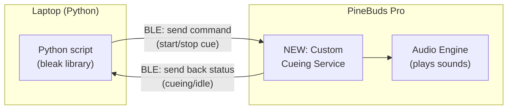
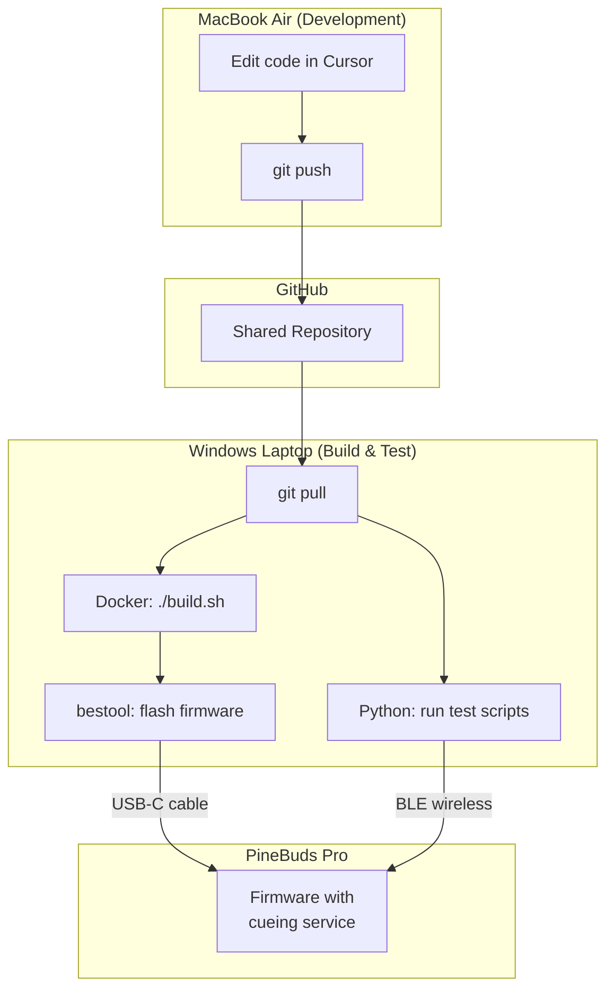

# What Was Changed and Why — A Plain-English Guide

This document walks through every change made to the OpenPineBuds firmware and every new Python script added on the host side. It is written for someone who does not have deep knowledge of Bluetooth, embedded systems, or the BES2300 chip that powers the PineBuds Pro.

---

## 1. The Big Picture

The PineBuds Pro are open-source wireless earbuds. Out of the box, their firmware supports normal audio features — playing music, taking calls, pairing with a phone — all over "classic" Bluetooth.

The goal of this project is to make the earbuds do something new: **respond to wireless commands from a computer and play specific audio cues on demand**. This is for a system that helps people with Parkinson's disease by playing rhythmic sounds (like a metronome click) when a "freezing of gait" episode is detected by sensors.

The problem is that the stock firmware does not expose any way for a computer program to send it custom commands. The earbuds only understand standard audio protocols. We need to add a new "interface" — a custom Bluetooth Low Energy (BLE) service — that a Python script on a laptop can talk to.

---

## 2. How Bluetooth Low Energy Works (Simplified)

Think of a BLE device like a **restaurant with a menu**.

- The **restaurant** is the earbud. It advertises its name ("PineBuds Pro") so nearby devices can find it.
- A **menu** is called a **GATT Service**. It is a group of related things the earbud can do. Each service has a unique ID (called a UUID) so it can be told apart from other services.
- Each **dish on the menu** is called a **Characteristic**. A characteristic is a single piece of data you can interact with. Some characteristics you can read (like checking the price), some you can write to (like placing an order), and some can send you updates automatically (called "notifications" — like the waiter telling you your food is ready).

In our case, we added a new menu (service) to the earbud with three dishes (characteristics):

| Characteristic | What it does | How you interact |
|---|---|---|
| **Cue Command** | You send commands here: "start playing a sound" or "stop" | Write |
| **Cue Status** | The earbud tells you what it is doing: idle, cueing, or error | Read and Notify |
| **Cue Config** | You set parameters here: which tone, how loud, how long | Read and Write |

Each of these has its own UUID — a long unique string like `ac000002-cafe-b0ba-f001-deadbeef0000` — that the Python script uses to find and talk to the right characteristic.

---

## 3. What We Added to the Earbud Firmware

The firmware is written in C and uses a layered architecture. Adding a new BLE service requires changes at three levels: the **profile layer**, the **app layer**, and small pieces of **registration glue** in existing files.

We followed the exact same pattern used by an existing service in the firmware called `DATAPATHPS` (a data path server). Every structural decision mirrors that existing code, adapted for our cueing use case.

### 3a. The Profile Layer — "Telling Bluetooth what exists"

These files define the GATT service at the Bluetooth protocol level. They describe what characteristics exist, what their UUIDs are, and what permissions they have (read, write, notify). They also handle the low-level Bluetooth messages when a remote device reads or writes a characteristic.

**New files:**

- `services/ble_profiles/cueing/cueingps/api/cueingps_task.h`
  Defines the message IDs and data structures used to pass information between the Bluetooth stack and our application code. For example, it defines a "command received" message and a "send status notification" message.

- `services/ble_profiles/cueing/cueingps/src/cueingps.h`
  Defines the attribute state machine — an enum listing every entry in our GATT table (service declaration, each characteristic declaration, each value, each descriptor). Also defines the environment struct that holds per-connection state like "are notifications enabled for this connection?"

- `services/ble_profiles/cueing/cueingps/src/cueingps.c`
  Contains the actual **GATT attribute database** — a table that maps each attribute index to its UUID, permissions, and maximum data length. This is the "menu" that Bluetooth reads to know what the service offers. Also contains lifecycle functions (init, destroy, create, cleanup) that allocate and free memory for the service.

- `services/ble_profiles/cueing/cueingps/src/cueingps_task.c`
  Handles the raw Bluetooth events: when a remote device writes to a characteristic, this code figures out *which* characteristic was written to and forwards the data up to the application layer as a kernel message. It also handles read requests and sends back the appropriate data.

### 3b. The App Layer — "Deciding what to do"

These files contain the actual application logic. When the profile layer says "someone wrote bytes to the Cue Command characteristic," the app layer decides what those bytes mean and takes action.

**New files:**

- `services/ble_app/app_cueing/app_cueing_server.h`
  Public header file. Defines the command bytes (`0x01` = start, `0x02` = stop, `0x03` = configure), the status bytes (`0x00` = idle, `0x01` = cueing), and the configuration structure (tone ID, volume, duration, burst count, burst gap). Also tracks burst playback state.

- `services/ble_app/app_cueing/app_cueing_server.c`
  The heart of the feature. Implements:
  - **Volume control**: Maps the 0-100 percentage from the host to the hardware's 16 volume levels via `app_bt_stream_volumeset()`.
  - **Duration-based auto-stop**: Uses BLE kernel timers (`ke_timer_set`) to automatically stop the cue after the configured `duration_ms`.
  - **Burst patterns**: Chains kernel timers to play N tone bursts separated by configurable gaps. Each burst plays a tone for `duration_ms`, waits `burst_gap_ms`, then repeats.
  - **Low-latency connection params**: When the client enables notifications, the firmware requests a 7.5-10ms connection interval update for minimal BLE round-trip latency.
  - **Audio stop**: Uses `app_audio_manager_sendrequest(APP_BT_STREAM_MANAGER_STOP, ...)` to properly stop media playback (the original `trigger_media_stop()` only handled one specific audio ID).

### 3c. Registration Glue — "Telling the existing firmware about the new service"

The firmware does not automatically discover new code. Several existing files had small additions to make them aware of the new cueing service. Every change follows the exact pattern already used for `DATAPATHPS`.

**Modified files:**

- `services/ble_stack/ble_ip/rwip_task.h`
  Added `TASK_ID_CUEINGPS = 78` to the task ID enum. Every BLE service needs a unique numeric ID in the system. The existing data path server is 74; ours is 78.

- `services/ble_stack/ble_ip/rwapp_config.h`
  Added `CFG_APP_CUEING_SERVER` (a build flag) and the corresponding `BLE_APP_CUEING_SERVER` macro. These act as on/off switches — if you remove the `#define`, the entire cueing service is excluded from the build.

- `services/ble_stack/ble_ip/rwprf_config.h`
  Added `BLE_CUEING_SERVER` at the profile level, and included it in the list of known profiles. This tells the BLE stack "there is one more profile that might need resources."

- `services/ble_profiles/prf/prf.c`
  This file is the **profile registry**. It has a big `switch` statement that maps task IDs to profile interface functions. We added a case for `TASK_ID_CUEINGPS` that returns `cueingps_prf_itf_get()` — the function pointer table from our profile layer.

- `services/ble_app/app_main/app_task.c`
  This file is the **message router**. When a BLE message arrives from the cueing profile, the router needs to know where to send it. We added a case that forwards messages from `TASK_ID_CUEINGPS` to `app_cueing_server_table_handler`. We also added disconnect and MTU-change handlers so the cueing service is properly notified of connection events.

- `services/ble_app/app_main/app.c`
  This file manages the list of services to register at boot. We added the cueing service to the enum of services (`APPM_SVC_CUEING_SERVER`), added its registration function (`app_cueing_add_cueingps`) to the function pointer array, and added its init function to the boot sequence.

- `services/ble_app/Makefile`
  Added `app_cueing/*.c` to the list of source files to compile, and added the include paths so the compiler can find the cueing headers.

- `services/ble_profiles/Makefile`
  Added `cueing/cueingps/src/*.c` to the list of source files, and added the include paths for the cueing profile headers.

---

## 4. What We Added on the Computer Side (Python)

All Python scripts live in the `host/` directory. They use a library called **bleak**, which lets Python talk to BLE devices on Windows, Mac, or Linux.

- `host/cueing_uuids.py`
  A small file that defines all the UUIDs and command constants in one place. Every other script imports from here, so if a UUID ever changes, you only update it once.

- `host/scan_and_discover.py`
  **Step 1 test.** Scans the air for BLE devices, connects to the PineBuds Pro, and lists every GATT service and characteristic it finds. You run this first to confirm the custom cueing service actually shows up after flashing the new firmware.

- `host/test_cueing.py`
  **Step 2 test.** Connects, subscribes to status notifications, sends a "start cue" command, waits a few seconds, then sends "stop." It prints the status notifications it receives and measures the time between sending a command and getting the acknowledgment back (latency).

- `host/latency_benchmark.py`
  **Step 3 test.** Runs many start/stop cycles automatically and computes statistics (mean, median, min, max, standard deviation) on the round-trip latency. This data goes into the thesis to characterize system performance.

- `host/cueing_consumer.py`
  **HERMES integration.** Wraps all the BLE logic into a class with three methods that match the HERMES framework interface: `setup()` (connect at pipeline start), `process()` (handle incoming commands from the AI pipeline), and `teardown()` (disconnect at pipeline stop). This is what plugs into the larger FOG detection system.

- `host/requirements.txt`
  Lists the Python dependency: `bleak>=0.21.0`. Install with `pip install -r requirements.txt`.

---

## 5. How to Use It End-to-End

The development workflow uses two laptops because firmware compilation requires a specific Docker-based Linux toolchain, and BLE testing requires a machine physically near the earbuds.

**Step by step:**

1. **Edit** the firmware C code or Python scripts on the Mac in Cursor.
2. **Push** to GitHub: `git add -A && git commit -m "..." && git push`
3. On the Windows laptop, **pull**: `git pull`
4. **Build** the firmware: `./start_dev.sh` (enters the Docker container), then `./build.sh`
5. **Flash** the firmware onto the earbuds via USB-C through the charging case: `bestool` writes the binary
6. Take the earbuds out of the case, let them boot with the new firmware
7. **Run** `python host/scan_and_discover.py` to verify the cueing service is visible
8. **Run** `python host/test_cueing.py` to test audio cueing end-to-end
9. **Run** `python host/latency_benchmark.py` to measure performance for the thesis

---

## Summary of All Files

| File | Type | Purpose |
|---|---|---|
| `services/ble_profiles/cueing/cueingps/api/cueingps_task.h` | New | Message IDs and data structs for the BLE profile |
| `services/ble_profiles/cueing/cueingps/src/cueingps.h` | New | Attribute enum, environment struct, function declarations |
| `services/ble_profiles/cueing/cueingps/src/cueingps.c` | New | GATT attribute database and profile lifecycle |
| `services/ble_profiles/cueing/cueingps/src/cueingps_task.c` | New | Low-level BLE message handlers (read/write/notify) |
| `services/ble_app/app_cueing/app_cueing_server.h` | New | Command/status constants, config struct, API |
| `services/ble_app/app_cueing/app_cueing_server.c` | New | Command parsing, audio trigger, status feedback |
| `services/ble_stack/ble_ip/rwip_task.h` | Modified | Added TASK_ID_CUEINGPS = 78 |
| `services/ble_stack/ble_ip/rwapp_config.h` | Modified | Added BLE_APP_CUEING_SERVER build flag |
| `services/ble_stack/ble_ip/rwprf_config.h` | Modified | Added BLE_CUEING_SERVER profile flag |
| `services/ble_profiles/prf/prf.c` | Modified | Registered cueing profile in the profile registry |
| `services/ble_stack/ble_ip/rwble_hl_config.h` | Modified | Added BLE_APP_CUEING_SERVER to CFG_NB_PRF profile count |
| `services/ble_app/app_main/app_task.c` | Modified | Added message routing for cueing task; optimized slave preferred conn params |
| `services/ble_app/app_main/app.c` | Modified | Added cueing to service list, init, and registration |
| `services/ble_app/Makefile` | Modified | Added cueing source files and include paths |
| `services/ble_profiles/Makefile` | Modified | Added cueing source files and include paths |
| `host/cueing_uuids.py` | New | UUID and constant definitions for Python side |
| `host/scan_and_discover.py` | New | BLE scan and GATT service enumeration script |
| `host/test_cueing.py` | New | End-to-end cueing test with config read, burst, latency |
| `host/latency_benchmark.py` | New | Latency benchmark with percentiles, CSV/JSON export |
| `host/cueing_consumer.py` | New | HERMES Consumer with auto-reconnect and operation logging |
| `host/cueing_fsm.py` | New | FSM cueing controller (threshold + FSM strategies) |
| `host/experiment_longevity.py` | New | Multi-hour BLE stability and latency degradation test |
| `host/experiment_compare_strategies.py` | New | Threshold vs FSM comparison on recorded FoG traces |
| `host/requirements.txt` | New | Python dependency list |
